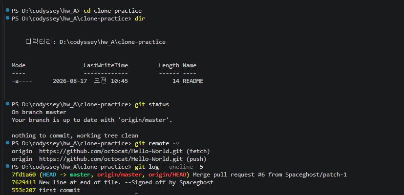
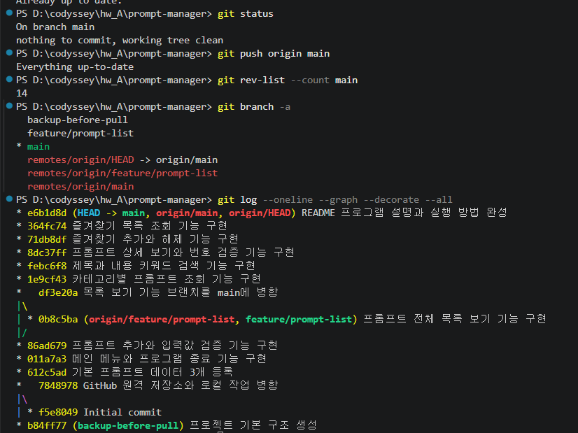
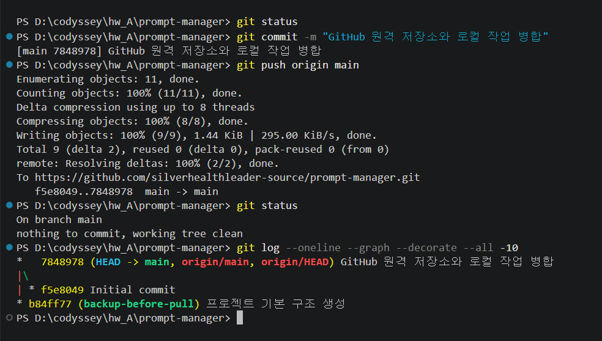

# 나만의 프롬프트 관리 프로그램

Python 기초 문법과 Git·GitHub 버전 관리를 학습하기 위해 제작한 콘솔 기반 프롬프트 관리 프로그램입니다.

터미널에서 메뉴 번호를 입력하여 프롬프트를 추가하고, 목록·카테고리·검색·상세 보기·즐겨찾기 기능을 사용할 수 있습니다.

## 주요 기능

1. 새로운 프롬프트 추가
2. 전체 프롬프트 목록 보기
3. 카테고리별 프롬프트 조회
4. 제목 또는 내용 키워드 검색
5. 프롬프트 상세 내용 보기
6. 즐겨찾기 추가 및 해제
7. 즐겨찾기 목록 보기
8. 잘못된 번호와 빈 입력값 안내
9. 프로그램 종료 후 메뉴 종료

## 기본 프롬프트

프로그램 시작 시 이전 미션에서 활용한 프롬프트 3개가 기본 데이터로 등록됩니다.

- 사회복지기관 생성형 AI 교육자료 작성
- 따뜻한 수채화 동화 삽화 생성
- 교육 문의 자동회신 작성

각 프롬프트는 다음 정보를 포함합니다.

- 제목
- 내용
- 카테고리
- 즐겨찾기 여부

## 프롬프트 카테고리

기본 카테고리는 다음과 같습니다.

- 텍스트 생성
- 이미지 생성
- 영상 생성
- 페르소나
- 자동화
- 기타

프롬프트를 추가할 때 새로운 카테고리를 직접 입력할 수도 있습니다.

## 개발 환경

- Python 3.10 이상
- Visual Studio Code
- Git
- GitHub
- 외부 라이브러리 사용 없음

## 실행 방법

### 1. 저장소 내려받기

```bash
git clone https://github.com/silverhealthleader-source/prompt-manager.git
```

### 2. 프로젝트 폴더로 이동

```bash
cd prompt-manager
```

### 3. 프로그램 실행

Windows 환경:

```bash
py prompt_manager.py
```

또는:

```bash
python prompt_manager.py
```

## 메뉴 구성

```text
=== 나만의 프롬프트 관리 ===
1. 프롬프트 추가
2. 프롬프트 목록
3. 카테고리별 조회
4. 프롬프트 검색
5. 프롬프트 상세 보기
6. 즐겨찾기 관리
7. 즐겨찾기 목록
0. 종료
```

## 데이터 저장 방식

프롬프트 데이터는 Python의 리스트와 딕셔너리를 사용하여 관리합니다.

프로그램 실행 중에 추가한 프롬프트와 변경한 즐겨찾기 상태는 유지됩니다. 프로그램을 종료하면 실행 중 추가한 데이터는 초기화되고 기본 프롬프트 3개로 돌아갑니다.


### 리스트와 딕셔너리를 선택한 이유

이 프로그램은 여러 개의 프롬프트를 순서대로 저장하고 목록 번호로 조회해야 하므로 전체 프롬프트 모음에는 `list`를 사용했다. 각 프롬프트는 제목·내용·카테고리·즐겨찾기처럼 이름이 있는 여러 속성으로 구성되므로 개별 프롬프트에는 `dict`를 사용했다.

| 자료구조 | 장점 | 단점 | 이 프로그램에서의 용도 |
|---|---|---|---|
| 리스트(`list`) | 입력 순서 유지, `append()`로 간단히 추가, 번호 인덱싱 가능 | 제목으로 직접 찾을 수 없어 순차 탐색 필요, 데이터가 많아지면 검색 시간이 증가 | 여러 프롬프트의 순서와 목록 관리 |
| 딕셔너리(`dict`) | `title`, `content`, `category`, `favorite` 키로 의미가 명확함 | 키 이름을 일관되게 사용해야 하며 프롬프트 여러 개의 순서 관리는 별도로 필요 | 프롬프트 한 건의 속성 관리 |

현재 데이터 규모가 작고 Python 기초 문법을 학습하는 필수과제이므로 구현이 단순하고 이해하기 쉬운 리스트와 딕셔너리 조합을 선택했다.

### 프롬프트 데이터 필드 명세

프롬프트 한 건은 다음 네 개의 필드를 가진다.

| 필드 | 자료형 | 역할 |
|---|---|---|
| `title` | 문자열(`str`) | 프롬프트 제목 |
| `content` | 문자열(`str`) | 프롬프트 본문 |
| `category` | 문자열(`str`) | 분류 카테고리 |
| `favorite` | 불리언(`bool`) | 즐겨찾기 여부 |

### 데이터 영속화 여부와 확장 설계

현재 버전은 필수과제의 “프로그램 종료 후 초기화” 조건과 Python 리스트·딕셔너리 학습 목적에 맞춰 메모리 기반으로 구현했다. 따라서 프로그램 실행 중에는 데이터가 유지되지만, `0`을 입력해 종료한 후 다시 실행하면 기본 프롬프트 3개로 초기화된다.

향후 프로그램 종료 후에도 데이터를 유지해야 한다면 `prompts.json` 파일을 사용하는 방식으로 확장할 수 있다. JSON은 Python의 리스트·딕셔너리 구조와 대응하고 사람이 직접 읽기 쉬우며 별도 데이터베이스 설치가 필요 없기 때문에 소규모 콘솔 프로그램에 적합하다.

예정된 영속화 흐름은 다음과 같다.

1. 프로그램 시작 시 `prompts.json` 존재 여부 확인
2. 파일이 있으면 `json.load()`로 프롬프트 목록 불러오기
3. 파일이 없으면 기본 프롬프트 3개 사용
4. 프롬프트 추가 또는 즐겨찾기 변경 직후 `json.dump()`로 저장
5. 파일 손상이나 읽기 오류가 발생하면 오류를 안내하고 기본 데이터로 안전하게 시작

CSV는 중첩 구조와 불리언 값 관리가 불편하고, 데이터베이스는 현재 규모에 비해 설정이 복잡하므로 향후 확장 형식으로 JSON을 우선 선택했다. 이 설계는 향후 개선안이며 현재 필수과제 코드에는 영속화를 구현하지 않았다.

### 중복 제목 처리 정책

현재 버전에서는 같은 제목의 프롬프트 추가를 허용한다. 같은 제목이라도 내용이나 카테고리가 다른 프롬프트를 등록할 수 있으며, 목록에 부여되는 번호를 이용해 각각 구분한다. 따라서 현재 프로그램은 중복 제목을 덮어쓰거나 병합하지 않고 별도 항목으로 추가한다.

향후 데이터 영속화와 수정·삭제 기능을 도입할 경우에는 다음 정책을 적용할 예정이다.

1. 제목 입력 후 기존 프롬프트의 제목과 정확히 일치하는지 검사
2. 일치하는 제목이 있으면 중복 안내문 표시
3. 사용자가 새 항목 등록을 선택하면 제목 뒤에 `(2)`, `(3)` 번호 부여
4. 기존 항목 덮어쓰기는 사용자가 명시적으로 확인한 경우에만 허용
5. 자동 병합은 내용 손실 위험이 있으므로 사용하지 않음

### `while` 반복문 설계와 종료 조건

메인 메뉴는 사용자가 한 기능을 실행한 후 다른 기능을 계속 선택할 수 있어야 하므로 `main()`에서 `while True` 반복문을 사용했다. 반복문이 없다면 메뉴가 한 번만 실행되고 프로그램이 바로 끝난다.

메뉴에서 `1`부터 `7`까지를 선택하면 해당 기능을 실행한 뒤 반복문의 처음으로 돌아가 메뉴를 다시 출력한다. 사용자가 `0`을 입력하면 종료 안내문을 출력하고 `break`를 실행하여 반복문과 프로그램을 정상 종료한다. 따라서 `while True`는 무한히 종료할 수 없는 구조가 아니라, 사용자에게 명확한 종료 선택인 `0`을 제공하는 메뉴 반복 구조이다.

또한 `input_required()`는 값이 입력될 때까지, `select_category()`는 올바른 번호가 입력될 때까지 반복한다. 두 함수 모두 유효한 값이 확인되면 `return`을 실행하므로 반복문이 종료된다.

## 코드 구조

기능별로 함수를 분리하여 작성했습니다.

- `input_required()` : 빈 입력값 방지
- `select_category()` : 카테고리 선택
- `add_prompt()` : 프롬프트 추가
- `show_list()` : 전체 목록 출력
- `show_by_category()` : 카테고리별 조회
- `search_prompt()` : 키워드 검색
- `show_detail()` : 상세 보기
- `manage_favorite()` : 즐겨찾기 추가·해제
- `show_favorites()` : 즐겨찾기 목록
- `show_menu()` : 메인 메뉴 출력
- `main()` : 프로그램 실행과 메뉴 선택 처리

## Git·GitHub 학습 내용

이 프로젝트에서는 다음 Git 명령어를 실습했습니다.

- `git init`
- `git add`
- `git commit`
- `git push`
- `git pull`
- `git checkout`
- `git clone`
- `git merge`

`feature/prompt-list` 브랜치에서 프롬프트 목록 기능을 개발하고, 기능 완성 후 `main` 브랜치에 병합했습니다.

### 공개 저장소 Clone 실행 증빙

GitHub의 공개 샘플 저장소를 실제로 복제하여 원격 저장소 연결과 커밋 로그를 확인했다.

실행 명령:

```powershell
git clone https://github.com/octocat/Hello-World.git clone-practice
cd clone-practice
dir
git remote -v
git log --oneline -5
```

실행 결과:

- `clone-practice` 폴더가 새로 생성됨
- 복제된 저장소의 README 파일과 폴더 구조 확인
- `git remote -v`에서 원격 저장소 주소 확인
- `git log --oneline -5`에서 공개 저장소의 커밋 기록 확인

실제 실행 화면:

- [공개 저장소 Clone 및 로그 확인 화면](prompt-manager_과제제출증빙/35_공개저장소_Clone및로그확인.png)



### 기능 단위 커밋 정책

커밋은 한 번에 여러 기능을 섞지 않고 하나의 기능 또는 하나의 문서 보완 단위로 생성했다. 이를 통해 오류가 발생했을 때 어떤 기능에서 문제가 생겼는지 쉽게 찾고, 필요한 변경만 확인하거나 되돌릴 수 있도록 했다.

커밋 기준은 다음과 같다.

1. 기능 하나를 완성하고 실행 확인까지 끝낸 후 커밋
2. 관련 없는 코드와 문서 변경은 같은 커밋에 섞지 않음
3. 커밋 전 `git status`와 실행 결과 확인
4. 커밋 메시지는 “대상 + 수행한 작업” 형식으로 작성
5. 기능 개발은 `구현`, 문서 변경은 `보완` 또는 `완성`, 병합 작업은 `병합`으로 표현

커밋 메시지 예:

```text
프롬프트 전체 목록 보기 기능 구현
카테고리별 프롬프트 조회 기능 구현
제목과 내용 키워드 검색 기능 구현
즐겨찾기 추가와 해제 기능 구현
README 프로그램 설명과 실행 방법 완성
데이터 구조와 반복문 및 저장 정책 설계 보완
```

실제 커밋 기록:

- [전체 커밋 기록](https://github.com/silverhealthleader-source/prompt-manager/commits/main/)
- [`506b0f7` 데이터 구조와 반복문 및 저장 정책 설계 보완](https://github.com/silverhealthleader-source/prompt-manager/commit/506b0f74f3d2e444951884a00c9488e528c7cead)
- [`b2f5a58` 필수과제 실행 증빙 문서와 캡처 보완](https://github.com/silverhealthleader-source/prompt-manager/commit/b2f5a58527c5c9b86f2ab7cfe949dbba51e58c95)
- [`364fc74` 즐겨찾기 목록 조회 기능 구현](https://github.com/silverhealthleader-source/prompt-manager/commit/364fc74d50f2e9047824d56374a3b20cb6ead267)
- [`71db8df` 즐겨찾기 추가와 해제 기능 구현](https://github.com/silverhealthleader-source/prompt-manager/commit/71db8df539d06f6c7cdc26e40be06dac4f24b8d0)
- [`8dc37ff` 프롬프트 상세 보기와 번호 검증 기능 구현](https://github.com/silverhealthleader-source/prompt-manager/commit/8dc37ffa451f4bb39bfee84820475698ee88b6aa)
- [`febc6f8` 제목과 내용 키워드 검색 기능 구현](https://github.com/silverhealthleader-source/prompt-manager/commit/febc6f8af2009a0fd01c97887440ed0118ebabb3)
- [`1e9cf43` 카테고리별 프롬프트 조회 기능 구현](https://github.com/silverhealthleader-source/prompt-manager/commit/1e9cf43f803f838166f93c98e0ad36132bf03076)

### 브랜치 생성과 병합 실행 증빙

목록 기능은 `feature/prompt-list` 브랜치에서 분리하여 개발했다. 기능 구현과 테스트를 완료한 후 `main`으로 이동하여 `--no-ff` 방식으로 병합했다. `--no-ff`를 사용한 이유는 기능 브랜치에서 작업한 이력을 Git 그래프에 별도로 남기기 위해서다.

실행 명령:

```powershell
git checkout -b feature/prompt-list
git add prompt_manager.py
git commit -m "프롬프트 전체 목록 보기 기능 구현"
git checkout main
git merge --no-ff feature/prompt-list
git log --oneline --graph --decorate --all
```

실제 브랜치 및 병합 증빙:

- [GitHub 브랜치 목록](https://github.com/silverhealthleader-source/prompt-manager/branches)
- [`feature/prompt-list` 브랜치](https://github.com/silverhealthleader-source/prompt-manager/tree/feature/prompt-list)
- [브랜치 생성·커밋·병합 그래프 화면](prompt-manager_과제제출증빙/19_브랜치생성_커밋_병합그래프.png)
- [최종 Git 로그 그래프](prompt-manager_과제제출증빙/51_git_log_oneline_graph_최종.png)
- [GitHub 브랜치 목록 화면](prompt-manager_과제제출증빙/56_GitHub_브랜치목록.png)



### 병합 충돌의 원인·해결·검증 과정

#### 1. 충돌 원인

로컬 컴퓨터와 GitHub 웹에서 `README.md`의 같은 위치를 서로 다르게 수정했다. 그 상태에서 `git pull --no-rebase origin main`을 실행하면서 Git이 두 변경 사항을 자동으로 선택하지 못해 `README.md` 내용 충돌이 발생했다.

#### 2. 충돌 확인

다음 명령으로 충돌 파일을 확인했다.

```powershell
git status
```

`README.md`에 다음 충돌 표시가 생성된 것을 확인했다.

```text
<<<<<<< HEAD
로컬 변경 내용
=======
GitHub에서 받은 변경 내용
>>>>>>> origin/main
```

#### 3. 충돌 해결

1. VS Code에서 `README.md`를 열었다.
2. 로컬의 개발·실행 증빙 링크를 유지했다.
3. 충돌 표시인 `<<<<<<<`, `=======`, `>>>>>>>`를 제거했다.
4. 파일을 저장했다.
5. 다음 명령으로 해결 완료 상태를 등록했다.

```powershell
git add README.md
git commit -m "GitHub 변경사항 병합 및 README 충돌 해결"
```

#### 4. 해결 결과 검증

다음 명령으로 충돌이 남아 있지 않은지 확인했다.

```powershell
git status
git log --oneline --graph --decorate --all
git push origin main
```

검증 결과:

- `README.md` 충돌 표시 제거 확인
- 병합 커밋 `8e8bf4c` 생성 확인
- `main` 브랜치로 push 완료
- `nothing to commit, working tree clean` 확인

실제 증빙:

- [Push 거절과 GitHub 변경 사항 확인](prompt-manager_과제제출증빙/09_Push거절_GitHub변경사항확인.png)
- [README 충돌 해결과 병합 완료](prompt-manager_과제제출증빙/11_README충돌해결_병합완료.png)
- [`8e8bf4c` 충돌 해결 병합 커밋](https://github.com/silverhealthleader-source/prompt-manager/commit/8e8bf4c1174a79911625f24a73f8c04adc8dabc4)



## 저장소 주소

https://github.com/silverhealthleader-source/prompt-manager

## 개발 및 실행 증빙

개발 환경 설정, 공개 저장소 clone, 프로그램 실행 결과, 브랜치 생성·병합 및 충돌 해결 과정은 다음 문서에 정리했다.

- [필수과제 개발 및 실행 증빙](EVIDENCE.md)
- [실행 결과 이미지 폴더](prompt-manager_과제제출증빙)

